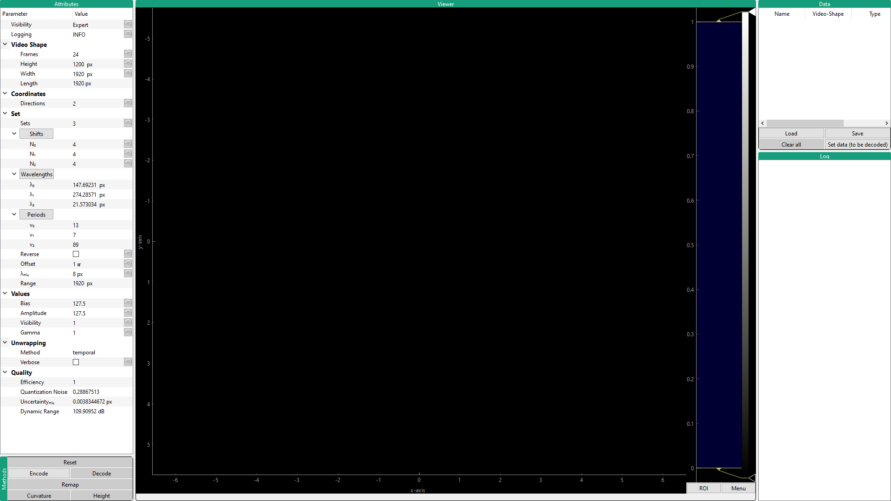

# Fringes-GUI
Author: Christian Kludt

## Description
Graphical user interface for the [fringes](https://pypi.org/project/fringes/) package.

## Installation
You can install `fringes-gui` directly from [PyPi](https://pypi.org/project/fringes-gui) via `pip`:

```
pip install fringes-gui
```

## Usage
You import the `fringes-gui` package and call the function `run()`.

```python
import fringes_gui as fgui
fgui.run()
```

Now the graphical user interface should appear:

\
Screenshot of the GUI.

### Parameter Tree
In the top left corner the attribute widget is located.
It contains the parameter tree with which all the properties of the `Fringes` class
from the [fringes](https://pypi.org/project/fringes/) package can be controlled.
Check out its website for more details.
However, if you select a parameter and hover over it, a tool tip will appear
containing the docstring of the respective property of the `Fringes` class.

The Visibility defines the type of user that should get access to the feature.
It does not affect the functionality of the features but is used by the GUI to
decide which features to display based on the current user level. The purpose
is mainly to ensure that the GUI is not cluttered with information that is not
intended at the current visibility level. The following criteria have been used
for the assignment of the recommended visibility:
- Beginner:\
  Features that should be visible for all users via the GUI. This
  is the default visibility. The number of features with 'Beginner' visibility
  should be limited to all basic features so the GUI display is well-organized
  and easy to use.
- Expert:\
  Features that require a more in-depth knowledge of the system
  functionality. This is the preferred visibility level for all advanced features.
- Guru:\
  Advanced features that usually only people with a sound background in phase shifting can make good use of.
- Experimental:\
  New features that have not been tested yet
  and are likely to crash the system at some point.

### Function Buttons
In the bottem left corner you will find buttons for the associated methods of the `Fringes` class.
Alternatively, you can use the keyboard shortcuts which are displayed when you hover over the buttons.
The buttons are only active if the necessary data has been enoded, decoded or loaded.

### Viewer
In the center resides the viewer.
If float data is to be displayed, `nan` is replaced by zeros.

### Data
In the top right corner the data widget is located.
It lists the data which has been encoded, decoded or was loaded.

In order to keep the [Parameter Tree](#parameter-tree) consistent with the data,
once a parameter has changed, certain data will be removed
and also certain [buttons](#function-buttons) will be deactivated.
As a consequence, if you load data - e.g. the acquired (deflected) fringe pattern sequence - 
the first element of its videoshape has to match the parameter `Frames` in order to be able to decode it.

To display any datum listed in the table in the [Viewer](#viewer), simly select the name of it in the table.

Klick the `Load` button to choose a data or parameter set to load.
With the `Save` button, all data including the parameter set are saved to the selected directory.
Use the `Clear all` button to delete all data.

Please note: By default, the datum `fringes` is decoded.
If you want to decode a datum with a different name (e.g. one that you just loaded),
select its name in the table and klick `Set data (to be decoded)`.

### Log
The logging of the `Fringes` class is displayed here.
The logging level can be set in the [Parameter Tree](#parameter-tree).

## License
Creative Commons Attribution-NonCommercial-ShareAlike 4.0 International Public License
